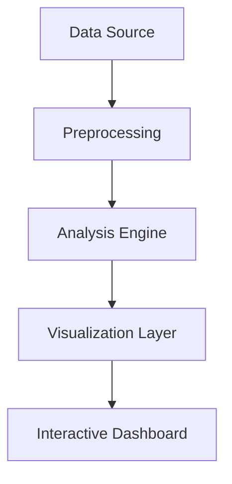

<div align="center">

# 🎯 Corporate Stress Analysis Dashboard

[](https://streamlit.io/apps)
[](https://www.python.org/downloads/)
[](https://opensource.org/licenses/MIT)

A powerful dashboard for analyzing workplace stress factors and their impacts across corporate dimensions.

[Explore Demo](#) • [Report Bug](#) • [Request Feature](#)

---
</div>

## 📋 Table of Contents
- [Overview](#-overview)
- [Data Insights](#-data-insights)
- [Features](#-features)
- [Installation](#-installation)
- [Usage](#-usage)
- [Architecture](#%EF%B8%8F-architecture)
- [Contributing](#-contributing)
- [License](#-license)

## 🔭 Overview

This dashboard provides interactive insights into employee stress levels, workplace dynamics, and organizational patterns through intuitive visualizations and comprehensive analysis tools.

<details>
<summary><strong>Why This Dashboard?</strong></summary>

- 📊 Real-time stress level monitoring
- 🔄 Interactive data filtering
- 📈 Comprehensive statistical analysis
- 👥 Department-wise comparisons
- ⚖️ Gender equality insights
- 🏢 Workplace dynamics visualization

</details>

## 📊 Data Insights

### 🎯 Key Findings

<table>
<tr>
<td width="50%">

#### 📈 Stress Distribution
- Average level: ~5.0 (moderate)
- Uniform across departments
- Significant high-stress cases (>7)

#### 🏢 Departmental Analysis
- ~2,730 employees per department
- Consistent working hours
- Similar stress patterns

</td>
<td width="50%">

#### ⚖️ Work-Life Balance
- Variable remote work impact
- Correlation with stress levels
- Uniform working hours

#### 👥 Gender Equality
- Equal representation
- Similar stress levels
- Comparable salaries

</td>
</tr>
</table>

### 📑 Data Structure

```python
Dataset Variables:
├── Stress_Level (0-10)
├── Gender
├── Department
├── Working_Hours_per_Week
├── Experience_Years
├── Sleep_Hours
├── Work_Life_Balance
├── Monthly_Salary_INR
└── Remote_Work
```

## 🚀 Features

<table>
<tr>
<td width="33%">

### 🎛️ Interactive Controls
- Department filtering
- Gender selection
- Experience range
- Real-time updates

</td>
<td width="33%">

### 📊 Visualizations
- Distribution plots
- Correlation heatmaps
- Time series analysis
- Comparative charts

</td>
<td width="33%">

### 📈 Analysis Tools
- Statistical metrics
- Trend analysis
- Pattern detection
- Insight generation

</td>
</tr>
</table>

## 🛠️ Architecture



### 📁 Project Structure
```
corporate-stress-analysis/
├── 📂 src/
│   ├── 📱 streamlit_app.py
│   ├── 📊 stress_analysis.py
│   └── ⚙️ config.py
├── 📂 data/
│   └── 📄 corporate_stress_dataset.csv
├── 📝 requirements.txt
└── 📖 README.md
```

## 📦 Installation

```bash
# Clone repository
git clone https://github.com/yourusername/corporate-stress-analysis.git

# Navigate to directory
cd corporate-stress-analysis

# Install dependencies
pip install -r requirements.txt

# Run dashboard
streamlit run src/streamlit_app.py
```

## 🔧 Tech Stack

<table>
<tr>
<td>

### 🐍 Core


</td>
<td>

### 📊 Visualization


</td>
</tr>
</table>

## 🤝 Contributing

1. Fork the Project
2. Create your Feature Branch (`git checkout -b feature/AmazingFeature`)
3. Commit your Changes (`git commit -m 'Add some AmazingFeature'`)
4. Push to the Branch (`git push origin feature/AmazingFeature`)
5. Open a Pull Request

## 📄 License

Distributed under the MIT License. See `LICENSE` for more information.

<div align="center">

---

<p>
👤 <i>Created by Your Name</i>
</p>

<p>
📧 <a href="mailto:your.email@example.com">your.email@example.com</a> •
🌐 <a href="https://github.com/yourusername">GitHub</a>
</p>

</div>
